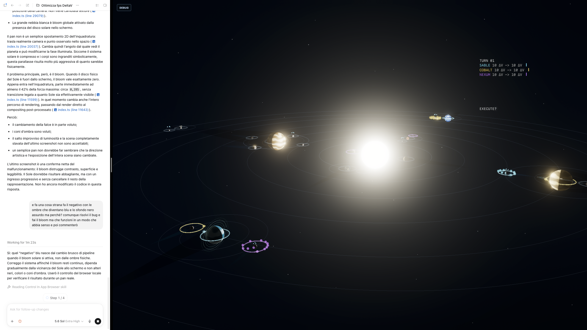

# DeltaV / AV Current Canon v10

This is the first file to read. It overrides v1-v9 when they conflict.

DeltaV is also referred to as AV in older design notes.

## 1. Identity

DeltaV is a minimal hard-sci-fi orbital strategy game about corporate warfare beyond the protected Earth-Moon corridor.

Core design sentence:

```text
Hard-sci-fi orbital warfare reduced to its essential decisions.
```

Updated map design sentence:

```text
The planet is the gravity anchor. The moon is the tactical ground. The orbit is the war clock.
```

The game is not about conquering abstract territory. It is about remaining the last faction with a viable path to tritium production and movement.

## 2. Current rules baseline

```text
Starting dV: 10 per faction
Global dV reserve per faction
Tritium Work: +2 dV per worked tritium node
Shipyard Work: 5 turns to produce 1 ship
Ship production dV cost: 0
Mandatory launch: when production completes, the incumbent ship must Burn out or is destroyed;
the newly assembled ship remains at the shipyard
Fire cost: 0 dV
FIRE ETA: same as equivalent BURN ETA
BURN ETA: hidden continuous transfer score, normally T+2 to T+7
Evade: 1 dV per missile impacting that ship this turn
Evade absorbs paid missile impacts but does not cancel other active firing solutions
Contested upkeep: 2 dV per contested ship/faction per turn
No extra Leave Contested BURN cost for now
```

## 3. Victory condition

A faction wins when it is the only faction that can still produce tritium indefinitely or restore access to tritium in a strategically viable way.

Prototype rule:

```text
At end-of-round Tritium Viability Check, a faction is viable if it has at least one plausible way to produce or contest tritium within the next short operational window using current ships, dV, transfers, or imminent shipyard output.

If only one faction is tritium-viable, that faction wins.
```

This replaces score, territorial conquest, and abstract victory points.

## 4. Turn resolution order

Canonical resolution order:

```text
1. Contested upkeep
2. Queued Mandatory Launch BURN departures
3. Missile impact + automatic/preventive Evade
4. Ship arrivals
5. Actions: Work eligibility, Fire and Burn orders
6. Economy:
   a. Tritium income
   b. Shipyard progress/completion
   c. Mandatory launch requirement for the incumbent ship when new output completes
```

Global WORK timing rule:

```text
WORK is evaluated after ship movement has resolved, but a ship that arrived by BURN during
that same turn is not Work-eligible until the following turn.

Same-turn arrivals can contest or block a node immediately.
They cannot extract Tritium and cannot advance Shipyard production until the next turn.
If a faction already had a ship at the destination before movement, that pre-existing ship may
still Work unless the node becomes contested, Evades, Burns, Fires, or is otherwise ordered.
```

FIRE is an action for that ship for the turn. A ship that Fires cannot Work that turn.
EVADE is also an action-consuming resolution: a ship that Evades one or more impacting missiles
cannot Work that turn.

Specific timing rule:

```text
If the same node has a queued Mandatory Launch BURN, an incoming missile, and an incoming ship
on the same turn, the Mandatory Launch departure resolves first, then missile impact/Evade,
then the incoming ship arrival. The incumbent ship leaves, the newly assembled ship left behind
can Evade if it was not contested at turn start, and only after that can the arriving ship make
the node contested.

Missile impacts resolve before same-turn ship arrivals.
A ship arriving on the same turn as a missile impact cannot prevent the target from Evading that missile.
To deny Evade through contested, the target must already be contested before the missile impact phase begins.
```

## 5. Evade is default defensive behavior

Evade is player-visible but should be treated by the interface as the default automatic survival response.

If a ship is working and missiles arrive:

```text
if faction has enough dV:
  ship automatically Evades
  1 dV is spent for each missile impacting that turn
  paid missile impacts are absorbed
  the ship does not Work that turn
else:
  ship is destroyed
```

The player may still need to override or plan around Evade, but the normal UI model is that Fire creates a future dV/time tax rather than micro-management.

Preventive Evade is not currently a separate player order:

```text
Evade only resolves when a missile hits a non-contested ship.
If the owner can pay 1 dV for the impacting missile, the ship Evades and survives that missile.
If multiple missiles hit in the same turn, the owner pays 1 dV per absorbed missile.
If the ship is contested or the owner cannot pay the next 1 dV, that missile destroys the ship.
BURN still cancels all firing solutions targeting the departing ship.
```

## 6. Contested

Contested is a physical lock, not damage.

```text
A contested ship cannot Work, Fire, or Evade.
It may Stay or Burn out.
```

Contested appears symmetric because both factions pay upkeep and commit a ship. In practice it is asymmetric when one side has nearby support.

```text
A ship in contested holds the target in place.
A support ship outside contested decides whether staying is safe.
```

Ships outside contested may Fire into the contested node or occupy reinforcement and escape routes.

## 7. Fire / missile role

Fire is not an immediate disable. It creates a future threat.

```text
Fire = future Evade tax / Work denial / dV pressure
Contested = present physical lock
```

With missile minimum travel time 2 and local ship travel time 1, Burn and Contested remain more important than pure missile spam.

Stacked Fire can be correct when it taxes multiple Evades, denies Work on productive nodes, or
forces ships off contested/productive positions. Isolated Fire against a comfortable target is still
usually low value because the firing ship gives up its own Work for the turn.

## 8. Shipyard progress is stealable

Shipyard progress belongs to the node, not the faction.

```text
If A works Mars to 2/5, leaves, and B later works Mars, B continues from 2/5.
```

This is intentional. Worked shipyards are bait, objectives, and theft opportunities.

## 9. Map canon v10: planets and moons only

Runtime default preset: Procedural Map · Balanced, including tutorial entry. The canonical v10 map
remains the fixed content and economy reference.

The canonical reference map uses only real planets and moons as active nodes. No asteroids, no Trojans, no Kuiper objects as active nodes in the baseline map.

Design criteria:

```text
Gas/ice giants are tritium nodes.
Rocky planets can be shipyard or barren/staging.
Moons can be shipyard or barren/staging.
A planetary system may contain 0 or 1 active shipyard.
No planetary system may contain more than 1 active shipyard.
Do not activate every real moon.
Only 1-3 moons per system should be active unless a scenario explicitly needs more.
```

Active map v10, 18 nodes:

```text
PROTECTED
Earth
Moon

TRITIUM
Jupiter
Saturn
Uranus
Neptune

SHIPYARD
Mercury
Mars
Titan
Pluto/Charon

BARREN / STAGING
Venus
Deimos
Callisto
Iapetus
Oberon
Triton
Nix
Hydra
```

## 10. Why not all moons?

The Solar System contains hundreds of moons, and the exact count changes as small moons are discovered and confirmed.

DeltaV should not activate all moons as nodes.

Design rule:

```text
Every active moon must create a decision.
If a moon only gives another place to hide or run, it should be visual/background, not an active node.
```

Baseline active node count target:

```text
18 nodes = clean baseline
20 nodes = rich but manageable
24 nodes = upper scenario limit
30+ active nodes = likely too much for core rules
```

## 11. Gas giant + shipyard in same system

This is allowed only with constraints.

Base rule:

```text
A planetary system may contain 0 or 1 active shipyard.
```

If a gas/ice giant tritium system also contains a shipyard moon, compensate with at least one of:

```text
shipyard WORK = 5 instead of 4
tritium planet ↔ shipyard moon travel time at least 2 turns
the key barren/staging moon must be contestable from outside
higher gravity / worse exit costs
```

In v10 baseline, Saturn is the intentionally dangerous hybrid hotspot:

```text
Saturn = tritium
Titan = shipyard
Iapetus = barren/staging
```

If Saturn is too strong in playtest, first patch:

```text
Titan shipyard: 5 WORK
Saturn ↔ Titan: minimum 2 turns
```

## 12. Orbital motion

Bodies move along deterministic orbital rails. Initial phases are generated by seed.

Orbital phase affects transfer cost and transfer duration. It creates strategic windows, not random chaos.

```text
Ship local transfer minimum: 1 turn
Missile local travel minimum: 2 turns
Longer transfers vary by orbital alignment
Bad alignment may increase dV cost, duration, or both
Forced burn may reduce duration at high dV cost
```

Transfer previews show only the currently executable plan: cost, duration, arrival, and route
geometry. DeltaV's planning cadence favors immediate, decision-relevant information.

## 13. Current map hypothesis

The v10 map should create these patterns:

```text
Inner player has shipyards but needs fuel.
Outer player has Pluto/Charon shipyard but needs Neptune/Uranus/Saturn fuel.
Jupiter is a rich tritium anchor without local shipyard.
Saturn is the central hybrid hotspot.
Uranus and Neptune are outer fuel systems without local shipyards.
Moons are tactical ground: Fire, staging, route control and contested support.
```

## 14. Canonical visual and color direction

The canonical color-language reference is:



DeltaV should read as a symbolic hard-science-fiction planetarium rather than a neutral or
photorealistic Solar System render.

```text
Space = near-black blue/graphite with visible depth, never a flat neutral black field
Solar light = broad warm ivory/pearl radiance with a controlled gray-gold falloff
Orbits and structural geometry = thin, desaturated steel-blue/gray lines
Bodies = readable silhouettes and restrained material color inside the solar light field
Gameplay accents = selective cyan, violet, green, yellow, and red with high local legibility
Overall contrast = luminous center against deep cool space, without recoloring shadows blue
```

The large solar luminance field, sparse stars, thin orbital construction, and isolated saturated
accents are part of DeltaV's identity. Preserve this relationship at every camera scale, including
wide system views and close-ups. Bloom may express the solar radiance, but must not switch the
whole scene to a different color pipeline or erase the graphite-blue background and neutral shadows.

The canonical main-menu banner is the detached top-down “planets crossing space” composition:

```text
Reference viewport: 2560 × 1440
Procedural reference seed: proc-ms4v3wlj-0puste0
Opening orbital phase: turn 76
Camera does not track a body
Sun is offset left; the menu occupies negative space on the right
Planets, moons, ships, and trajectories cross the static frame as the demo advances
```

This composition is the player’s opening view of DeltaV and should remain legible as a moving
banner rather than behaving like a gameplay focus camera.

## 15. Log, tutorial and lore style; conflict duration

Extended log entries are intradiegetic except for the existing control instructions.

```text
Write in concise, connected prose: closer to rigorous science journalism than a technical incident form.
Use complete sentences, explicit causal links and enough context for each entry to make sense on its own.
Terse means economical, not telegraphic. Avoid fragments, equation-like shorthand and repeated
"A does this. B does that." constructions.
For game rules, explain the rule first, its consequence second and its strategic use when relevant.
Resolution telemetry may remain compact, but it must use clear verbs or labels so the relationship
between action, subject, cost and result is immediately legible.
Expanded game explanations use two visually separate sections: concise rule text, one blank line,
then a short bullet list of consequences, options, examples or advanced considerations. The second
section has no heading. Lore entries remain continuous prose and do not use this structure.
Whenever the selected log line contains concrete state, explain that instance: the named faction,
current and projected ΔV, the costs and income behind the next-turn forecast, or that BURN's actual
origin, destination, cost, ETA and departure turn.
Advanced guidance describes consequences available to the player. It never exposes AI behavior,
hidden scoring, evaluation weights or implementation terminology.
Do not use slogans, aphorisms, punchlines, dramatic parallelism, or trailer-style phrasing.
```

The 2079 Saturn incident is the first confirmed use of a registered ship weapon against another
registered vessel. No fixed duration is canonical for the conflict that follows. Match length,
turn count, and provisional development estimates must not be converted into an in-world campaign
duration.

Player-facing copy calls every simulated position an `orbit`, always in lowercase. `node` is a
deprecated internal identifier and never appears in the log, tutorial, hover copy, or reports.
Economic copy names the actual site or facility (tritium plant, shipyard, yard, access); it never
uses `production orbit`.
